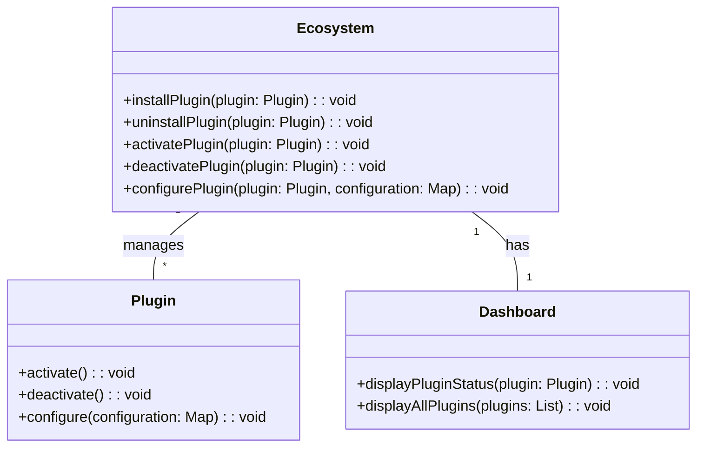

```mermaid
classDiagram
    class Ecosystem {
        +installPlugin(plugin: Plugin): void
        +uninstallPlugin(plugin: Plugin): void
        +activatePlugin(plugin: Plugin): void
        +deactivatePlugin(plugin: Plugin): void
        +configurePlugin(plugin: Plugin, configuration: Map<String, dynamic>): void
    }
    class Plugin {
        +activate(): void
        +deactivate(): void
        +configure(configuration: Map<String, dynamic>): void
    }
    class Dashboard {
        +displayPluginStatus(plugin: Plugin): void
        +displayAllPlugins(plugins: List<Plugin>): void
    }
    Ecosystem "1" -- "*" Plugin : manages
    Ecosystem "1" -- "1" Dashboard : has

```
